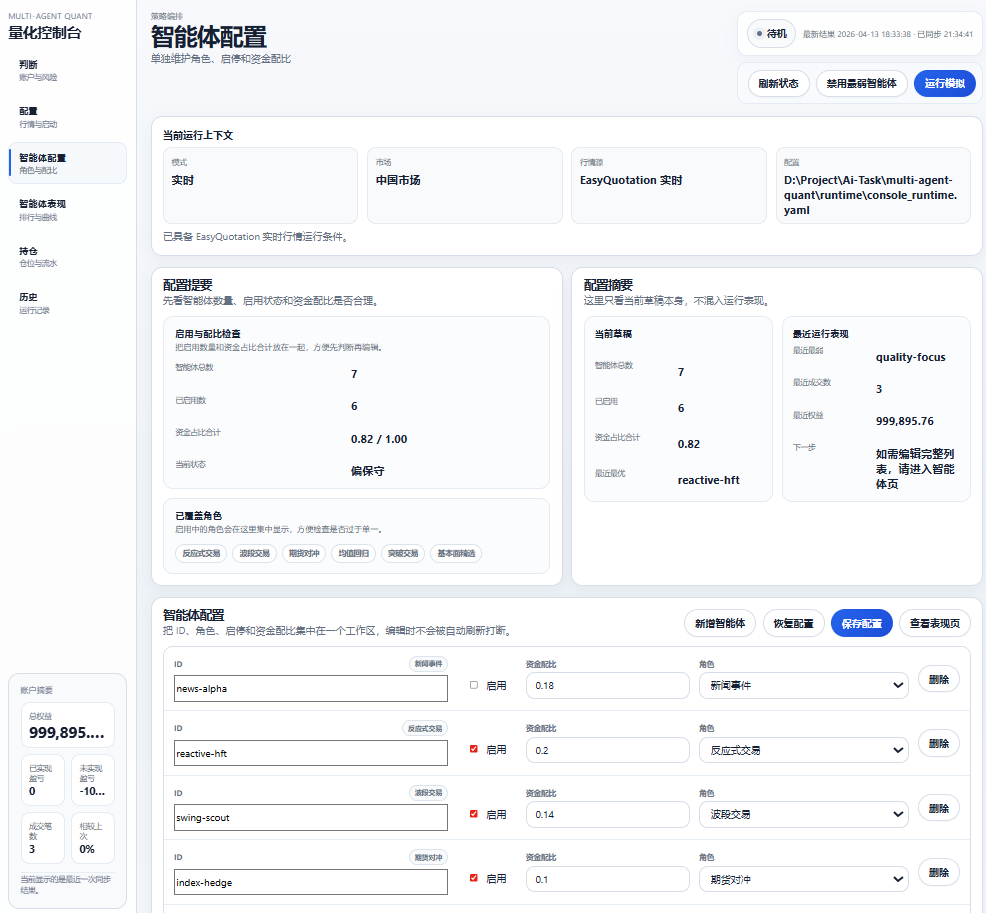
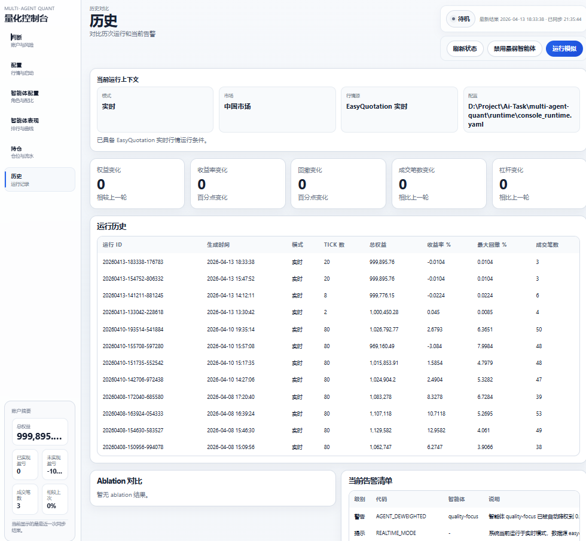

# Multi-Agent Quant

多智能体量化控制台与纸面交易系统，面向 A 股实时行情接入、策略协同、风险控制、组合跟踪和运行复盘。

当前项目已经打通一条可实际运行的链路：

`真实行情 -> 多智能体决策 -> 风控约束 -> Paper Execution -> 持仓与盈亏 -> 控制台可视化`

默认推荐的真实行情入口是 `EasyQuotation`，因为本地即可启用，不依赖 Tushare Token；同时也保留了 `Tushare` 与 `CSV 回放` 两种接入方式。

## 项目目标

这个项目不是单纯的策略脚手架，而是一个偏产品化的量化实验控制台。它想解决的问题是：

- 把多智能体量化系统从“离线回测想法”推进到“可观察、可操作、可复盘”的运行形态。
- 让用户可以在控制台里手动配置市场数据、智能体、风险参数与策略工厂参数。
- 在暂不接真实券商下单的前提下，把行情、持仓、盈亏、执行和历史记录尽可能做得接近真实运行流程。

## 当前能力

### 1. 行情接入

- `synthetic_cn`：合成行情，用于快速演示。
- `csv_replay`：导入真实历史或导出的分笔/快照数据进行回放。
- `tushare_realtime`：支持 Tushare 实时行情模式。
- `easyquotation_realtime`：支持 EasyQuotation 免费实时行情模式。

### 2. 多智能体协同

当前默认控制台配置已经扩展到 7 个智能体：

- `news-alpha`：新闻事件型
- `reactive-hft`：反应式交易
- `swing-scout`：波段交易
- `index-hedge`：期货对冲
- `mean-revert-core`：均值回归
- `breakout-beta`：突破交易
- `quality-focus`：基本面精选

### 3. 控制台能力

- 运行态查看：账户权益、已实现盈亏、未实现盈亏、成交笔数、历史对比
- 手动配置：模式、资金、轮询频率、风险预算、行情源、Tushare Token、CSV 参数、策略工厂参数、智能体列表
- 运行操作：保存配置、启动运行、刷新状态、禁用最弱智能体
- 运行输出：控制台会读取和展示 `runtime/` 下的运行结果、摘要和历史

### 4. 执行与风控

- 股票与期货纸面执行
- 基础手续费、印花税、点差与保证金模型
- 总风险敞口、单标的仓位、期货保证金、熔断阈值、最小置信度等限制
- 智能体收益差时自动降权

## 已验证状态

以下内容已在本地验证通过，验证时间为 `2026-04-13`：

- `EasyQuotation` 实时行情环境检查通过
- 实时行情探针可返回 `510300.SH` 的真实行情
- 控制台 `8765` 端口可访问
- `/api/state` 已确认当前生效行情源为 `easyquotation_realtime`
- `summary.data_source.market_feed_type` 已确认是 `easyquotation_realtime`
- `tests/test_console_service.py` 通过

当前默认实时配置文件：

`configs/system.easyquotation.local.yaml`

当前默认实时标的：

- `510300.SH`
- `600519.SH`
- `000001.SZ`

## 项目结构

```text
multi-agent-quant/
├─ configs/                     # 配置文件
├─ console/                     # 控制台前端
├─ docs/                        # 项目文档、博客、截图占位
├─ runtime/                     # 运行输出、摘要、历史、临时生效配置
├─ scripts/                     # 启动脚本、探针、环境检查脚本
├─ src/multi_agent_quant/
│  ├─ agents/                   # 智能体注册与基础行为
│  ├─ console/                  # 控制台服务层
│  ├─ data_layer/               # 行情/新闻/日历/数据管线
│  ├─ execution/                # 订单与纸面执行
│  ├─ market/                   # 市场仿真与对抗环境
│  ├─ portfolio/                # 组合大脑与资金分配
│  ├─ reasoning/                # LLM 路由
│  ├─ reporting/                # Dashboard 与运营摘要
│  ├─ risk/                     # 风控引擎
│  └─ strategy/                 # 策略工厂与因子
└─ tests/                       # 测试
```

## 快速开始

### 1. 安装依赖

```powershell
cd D:\Project\Ai-Task\multi-agent-quant
F:\anaconda3\python.exe -m pip install -e .
F:\anaconda3\python.exe -m pip install easyquotation tushare
```

### 2. 先检查实时行情环境

```powershell
F:\anaconda3\python.exe scripts\check_realtime_env.py --config configs\system.easyquotation.local.yaml
```

### 3. 探测几条真实行情

```powershell
F:\anaconda3\python.exe scripts\probe_market_feed.py --config configs\system.easyquotation.local.yaml --count 2
```

### 4. 启动控制台

```powershell
F:\anaconda3\python.exe scripts\control_console.py --host 127.0.0.1 --port 8765 --config configs\system.easyquotation.local.yaml
```

浏览器访问：

`http://127.0.0.1:8765/console/run`

### 5. 直接跑实时模式

```powershell
F:\anaconda3\python.exe scripts\run_realtime.py --config configs\system.easyquotation.local.yaml
```

## 配置说明

### 推荐配置：EasyQuotation 实时

文件：

`configs/system.easyquotation.local.yaml`

特点：

- 不需要 Tushare Token
- 适合本地先把真实行情链路跑通
- 可直接在控制台里查看、修改并保存参数

### 可选配置：Tushare 实时

如果你有 Tushare Token，可以切换到：

- `configs/system.tushare.yaml`
- `configs/system.tushare.example.yaml`
- `configs/system.tushare.local.yaml`

推荐把 Token 放在环境变量中：

```powershell
$env:TUSHARE_TOKEN="your-token"
```

然后在控制台中将行情源改为 `Tushare 实时`，或直接运行：

```powershell
F:\anaconda3\python.exe scripts\run_realtime.py --config configs\system.tushare.local.yaml
```

控制台中的 Tushare 状态现在会区分三种情况：

- `直连可用`：已检测到 Tushare 包和 Token
- `回退可用`：当前缺 Token 或直连异常，但可回退到 EasyQuotation
- `未就绪`：直连和回退都不可用

### 可选配置：CSV 回放

适合把外部真实数据导出为 CSV 后做接近实盘的流程验证。

需要配置这些字段：

- `path`
- `symbol_field`
- `price_field`
- `volume_field`
- `replay_interval_seconds`

## 控制台怎么用

控制台现在重点服务三个动作：判断、操作、追踪。

### 判断

- 看当前模式、市场、行情源、配置路径、行情就绪状态
- 看账户权益、已实现盈亏、未实现盈亏、成交笔数
- 看当前运行结果是否来自真实行情

### 操作

- 改运行模式、资金规模、轮询周期
- 改风险预算和风险控制参数
- 切换行情源为模拟、Tushare、EasyQuotation 或 CSV 回放
- 手动增删智能体、修改角色和资金占比
- 启动一次新的运行

### 追踪

- 看持仓和流水
- 看智能体收益和自动降权结果
- 看历史运行对比
- 看 `runtime/dashboard_summary.json` 和 `runtime/*.jsonl` 输出

## 运行产物

运行后通常会在 `runtime/` 看到这些文件：

- `console_runtime.yaml`：控制台当前生效配置
- `dashboard_summary.json`：控制台摘要
- `account_snapshot.json`：账户快照
- `*.jsonl`：成交流水或其他运行日志

## 这和真实实盘还有哪些差距

这个项目已经具备“真实行情 + 纸面执行 + 风控 + 控制台跟踪”的雏形，但还不是完整实盘系统。

当前仍有这些差距：

- 执行仍是 `paper trading`，还没有接真实券商柜台或 broker API
- 财务/基本面数据虽然配置里有 `tushare`，但当前仍会回退到静态骨架
- 新闻和情绪数据仍偏示意，并非完整实时新闻流
- 撮合、盘口深度、滑点、涨跌停、停牌、撤单队列等细节还不够接近真实交易所环境
- 还缺交易时段、异常网络、风控告警、人工确认等更强的生产机制

所以它现在更适合：

- 实时纸面交易
- 多智能体协同行为研究
- 接近实盘的控制台验证
- 后续接券商前的中间层产品化

## 截图占位

你可以把控制台截图放进 `docs/images/`，README 会直接引用这些位置。

建议文件名：

- `docs/images/console-overview.png`
- `docs/images/console-run.png`
- `docs/images/console-agents.png`
- `docs/images/console-portfolio.png`
- `docs/images/console-history.png`

### 控制台总览



### 运行配置页


### 智能体配置页


### 持仓与盈亏页


### 历史记录页



## 推荐下一步

- 接入真实基本面与新闻事件流
- 接入交易时段与交易日历限制
- 增加更贴近实盘的委托状态与成交回报
- 接入 broker 或仿真柜台前，先加告警、人工确认和审计日志

## 相关文档

- [实时行情说明](docs/REALTIME-DATA.md)
- [项目博客文档](docs/project-blog.md)
- [架构文档](docs/architecture.md)
