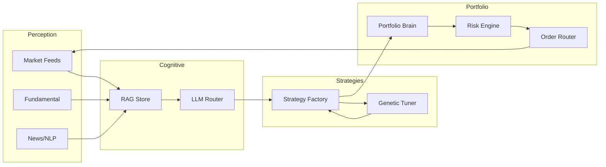

# Architecture Overview

> 对照《多智能体量化投资项目》整理的实现蓝图。所有层均可按需拆换。

## 1. Principles

- **Competition**: Agent 之间竞赛生成 alpha，失败者自动淘汰。
- **Collaboration**: 共享情绪、资金、风控状态，形成协作闭环。
- **Evolution**: 通过遗传算法 + LLM 迭代 Prompt / Code，实现自我改良。

## 2. Layered Design

| Layer | Description | Key Modules |
| --- | --- | --- |
| 1. Data & Perception | 多源行情、基本面、舆情、链上数据；支持延迟感知 & 事件提取 | `data_layer.feeds`, `pipelines` |
| 2. Reasoning | LLM / Graph RAG / 多模型协作，承担语义理解、情景解释 | `reasoning.llm_router`, `context_window` |
| 3. Strategy Factory | 模板 + 进化 + AutoML 生成策略、特征与超参 | `strategy.factory`, `strategy.templates` |
| 4. Execution Agents | 事件驱动 / 高频 / 套利 / 新闻驱动等多角色 | `agents.registry`, `agents.roles` |
| 5. Adversarial Market | 复刻极端行情，注入冲击、滑点、流动性枯竭 | `market.adversarial_env` |
| 6. Evolution & Evaluation | 多指标评估、遗传变异、参数迁移 | `evolution.evaluator`, `genetic_tuner` |
| 7. Portfolio Brain | 多臂老虎机、Bayesian Optimizer、Risk Budget | `portfolio.brain` |
| 8. Risk & Execution | 分层风险限额、委托管理、交易所路由 | `risk.engine`, `execution.order_router` |

## 3. Data Contracts

## 4. Config Model

`configs/system.example.yaml` 描述：
- 数据源（行情、舆情、区块链）
- Agent 池与调度参数
- 风控阈值（VAR、最大回撤、仓位）
- 执行适配器（模拟 / 实盘）

## 5. Deployment Notes

- 默认单机（适配 Windows dev 环境），可扩展到 Kubernetes/duix。
- 通过 `scripts/run_simulation.py` 驱动端到端流水线。
- 推荐接入消息总线（如 Redis Streams）实现跨 Agent 通信。

## 6. Roadmap

1. Phase 1: 骨架 + 回测仿真
2. Phase 2: 策略自动生成与多 Agent 互博
3. Phase 3: LLM/RL 深度增强
4. Phase 4: 生产级自动化（自动部署、实时监控）

